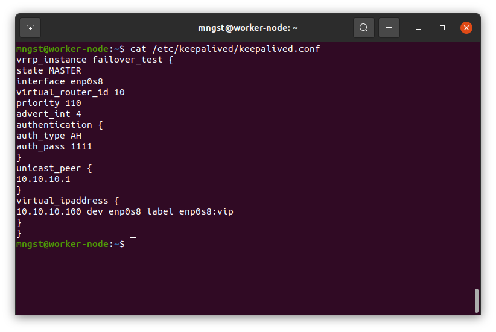
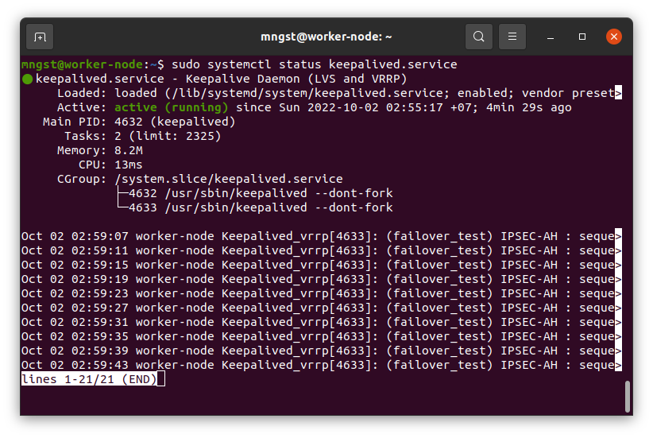
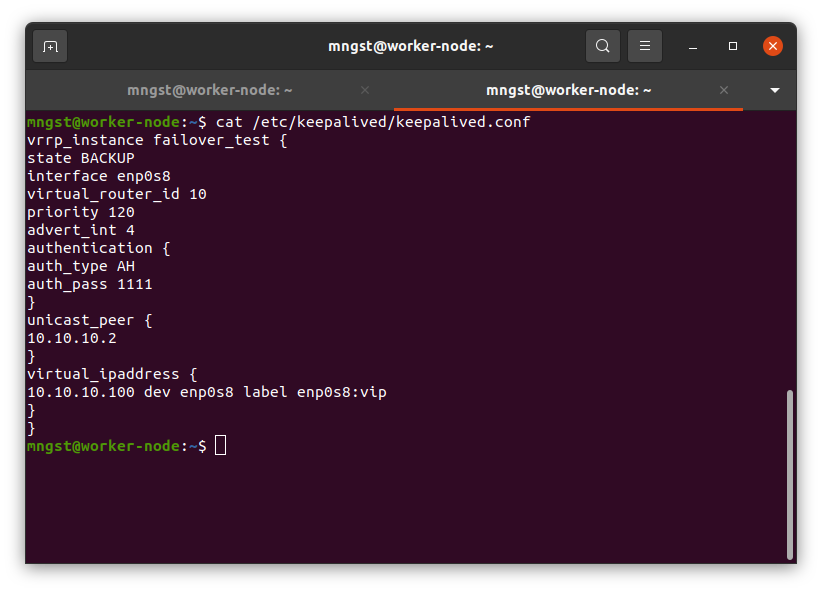
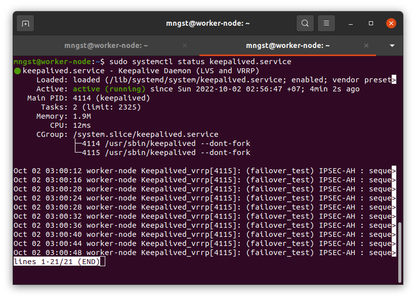
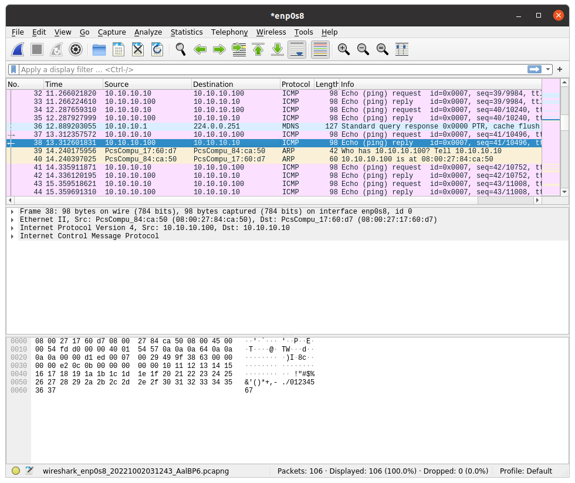

---

### Задание 1. 

Требуется развернуть топологию из лекции и выполнить установку и настройку сервиса Keepalived. 

*Пришлите скриншот рабочей конфигурации и состояния сервиса для каждого нода.*

## Дополнительные задания (со звездочкой*)

Эти задания дополнительные (не обязательные к выполнению) и никак не повлияют на получение вами зачета по этому домашнему заданию. Вы можете их выполнить, если хотите глубже и/или шире разобраться в материале.
 
### Задание 2*.

Проведите тестирование работы ноды, когда один из интерфейсов выключен. Для этого:
- добавьте еще одну виртуальную машину и включите ее в сеть;
- на машине установите wireshark и запустите процесс прослеживания интерфейса;
- запустите процесс ping на виртуальный хост;
- выключите интерфейс на одной ноде (мастер), остановите wireshark;
- найдите пакеты ICMP, в которых будет отображён процесс изменения MAC адреса одной ноды на другой. 

 *Пришлите скриншот до и после выключения интерфейса из Wireshark.*

