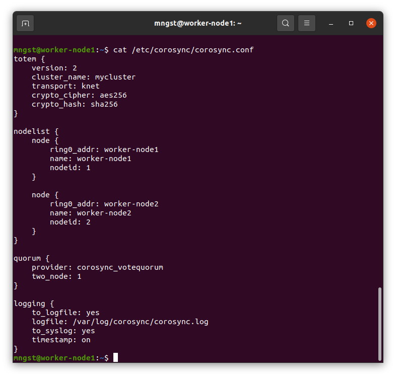
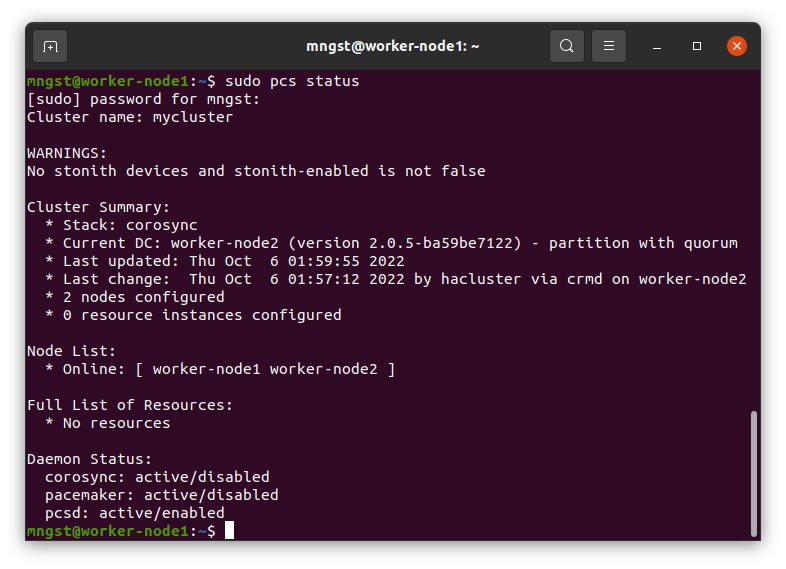
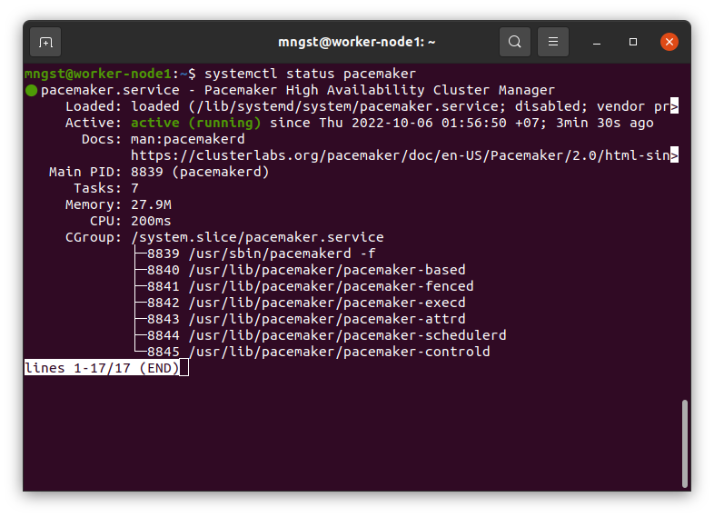
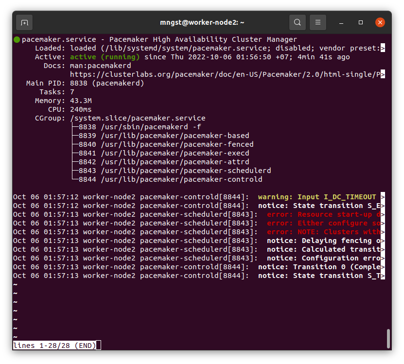

---

### Задание 1.

Опишите основные функции и назначение Pacemaker.

*Приведите ответ в свободной форме.*

Pacemaker - это менеджер ресурсов для высокодоступных кластеров (HA CRM). Запускается на группе хостов ( кластере ) для обеспечения отказоустойчивости и минимизации простоя сервисов или ресурсов.
Основные функции:
- Обнаружение и восстановление на уровне узлов и сервисов
- Обеспечение целостности данных изолированием проблемного узла
- Поддержка различных типов ресурсов
- Поддержка различных конфигураций отказоустойчивости ( active/passive, N+1... )
- Автоматическая репликация конфигураций на все узлы кластера
- Поддержка расширенных типов сервисов: клонов ( запущенных на множестве узлов ), stateful ресурсов ( клоны, которые могут работать в одном из двух режимов ), службы контейнеризации  

---

### Задание 2.

Опишите основные функции и назначение Corosync.

*Приведите ответ в свободной форме.*

Corosync предназначен для отслеживания и передачи состояния узлов кластера
Основные функции:
- Отслеживание состояния приложений
- Оповещение приложений о смене активной ноды кластера
- Отправка одинаковых сообщений процессам на всех узлах кластера
- Предоставление доступа к базе данных с конфигурацией и статистикой, отправка уведомлений о её изменениях

---

### Задание 3.

Соберите модель, состоящую из двух виртуальных машин. Установите pacemaker, corosync, pcs.  Настройте HA кластер.

*Пришлите скриншот рабочей конфигурации и состояния сервиса для каждого нода.*

---

### Дополнительные задания (со звездочкой*)
Эти задания дополнительные (не обязательные к выполнению) и никак не повлияют на получение вами зачета по этому домашнему заданию. Вы можете их выполнить, если хотите глубже и/или шире разобраться в материале.
 
---

### Задание 4.

Установите и настройте DRBD сервис для настроенного кластера.

*Пришлите скриншот рабочей конфигурации и состояние сервиса для каждого нода.*
