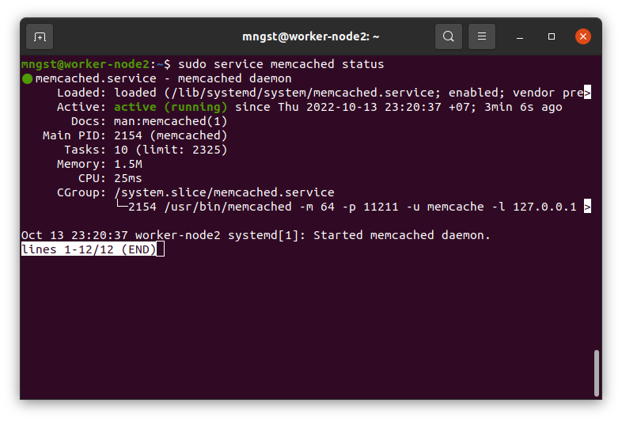
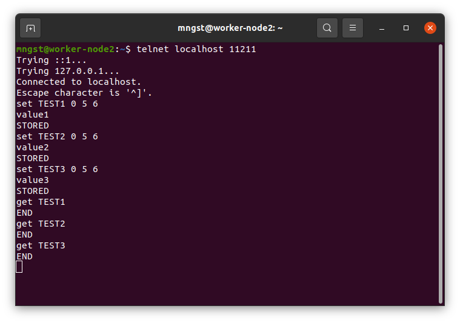
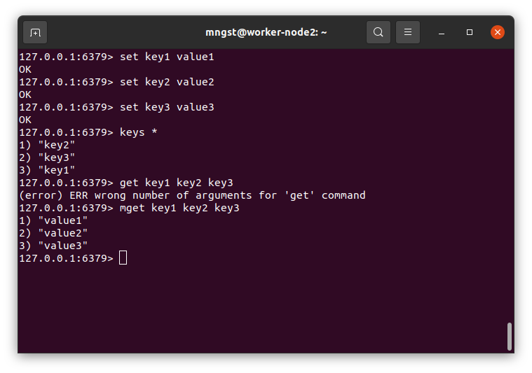
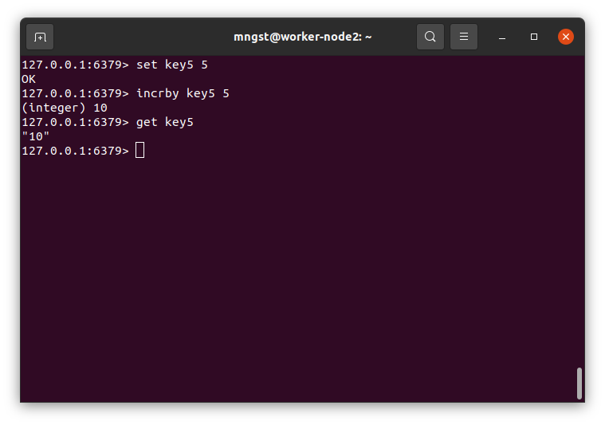

---

### Задание 1. Кэширование. 

Приведите примеры проблем, которые может решить кэширование.

*Приведите ответ в свободной форме.*

```
1. Повышение производительности
2. Снижение нагрузки на серверную часть
3. Сокращение затрат на базы данных
4. Сглаживание всплесков трафика
```
---

### Задание 2. Memcached.

Установите и запустите memcached.

*Приведите скриншот systemctl status memcached, где будет видно, что memcached запущен.*


---

### Задание 3. Удаление по TTL в Memcached.

Запишите в memcached несколько ключей с любыми именами и значениями, для которых выставлен TTL 5.

*Приведите скриншот, на котором видно, что спустя 5 секунд ключи удалилсь из базы.*


---

### Задание 4. Запись данных в Redis. 

Запишите в redis несколько ключей с любыми именами и значениями.

*Через redis-cli достаньте все записанные ключи и значения из базы, приведите скриншот этой операции.*



## Дополнительные задания (со звездочкой*)
Эти задания дополнительные (не обязательные к выполнению) и никак не повлияют на получение вами зачета по этому домашнему заданию. Вы можете их выполнить, если хотите глубже и/или шире разобраться в материале.

### Задание 5*. Работа с числами. 

Запишите в redis ключ key5 со значением типа "int" равным числу 5. Увеличьте его на 5, чтобы в итоге в значении лежало число 10.

*Приведите скриншот, где будут проделаны все операции и будет видно, что значение key5 стало равно 10.*


---
