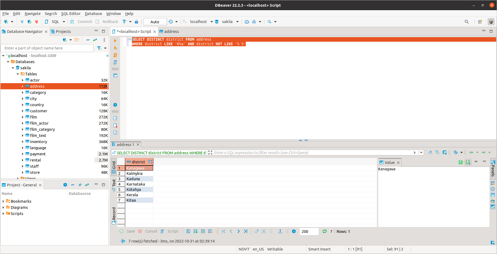
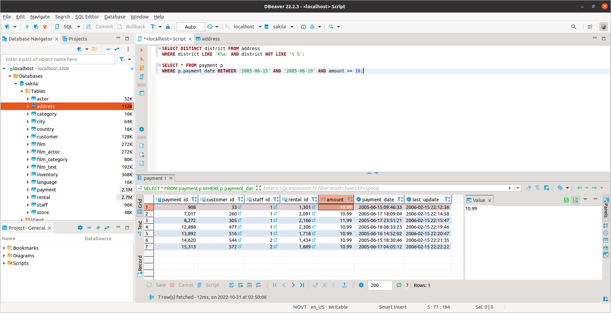
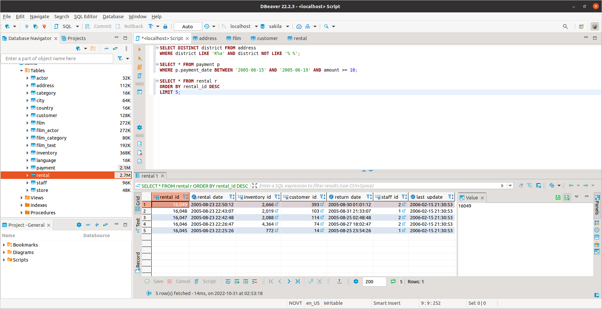
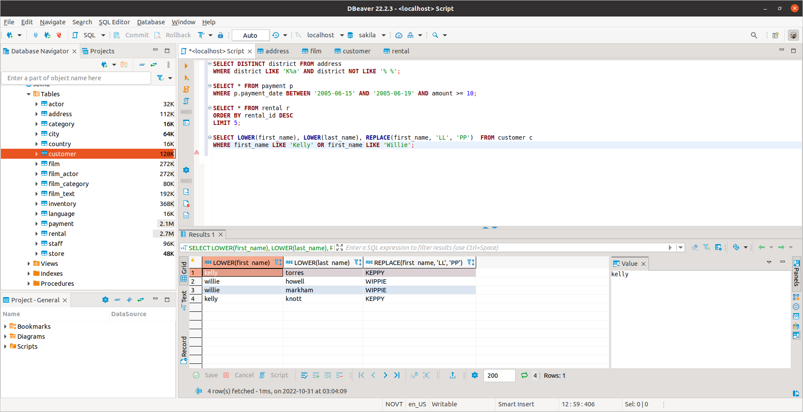
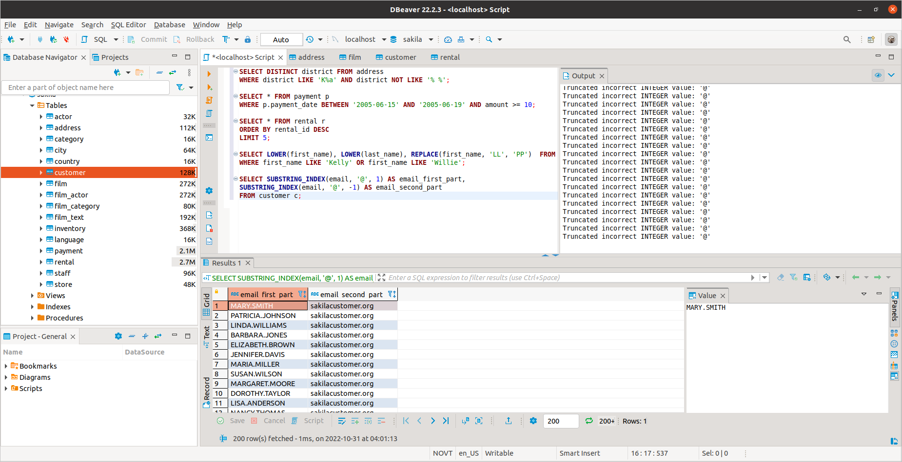
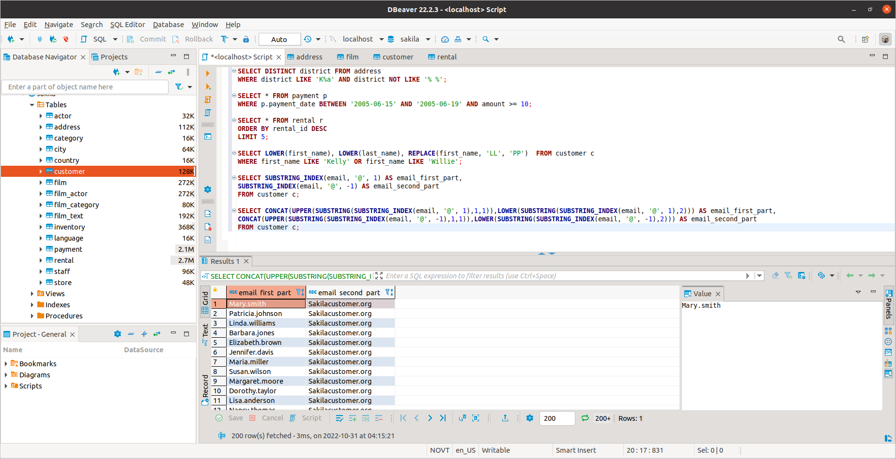

---

Задание можно выполнить как в любом IDE, так и в командной строке.

### Задание 1.

Получите уникальные названия районов из таблицы с адресами, которые начинаются на “K” и заканчиваются на “a”, и не содержат пробелов.

### Задание 2.

Получите из таблицы платежей за прокат фильмов информацию по платежам, которые выполнялись в промежуток с 15 июня 2005 года по 18 июня 2005 года **включительно**, 
и стоимость которых превышает 10.00.

### Задание 3.

Получите последние 5 аренд фильмов.

### Задание 4.

Одним запросом получите активных покупателей, имена которых Kelly или Willie. 

Сформируйте вывод в результат таким образом:
- все буквы в фамилии и имени из верхнего регистра переведите в нижний регистр,
- замените буквы 'll' в именах на 'pp'

## Дополнительные задания (со звездочкой*)
Эти задания дополнительные (не обязательные к выполнению) и никак не повлияют на получение вами зачета по этому домашнему заданию. Вы можете их выполнить, если хотите глубже и/или шире разобраться в материале.

### Задание 5*.

Выведите Email каждого покупателя, разделив значение Email на 2 отдельных колонки: в первой колонке должно быть значение, указанное до @, во второй значение, указанное после @.

### Задание 6.*

Доработайте запрос из предыдущего задания, скорректируйте значения в новых колонках: первая буква должна быть заглавной, остальные строчными.

