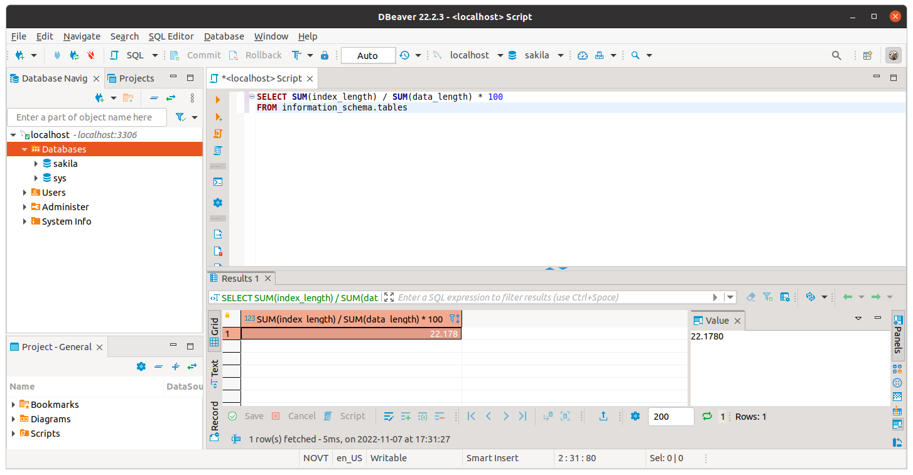

---

Задание можно выполнить как в любом IDE, так и в командной строке.

### Задание 1.

Напишите запрос к учебной базе данных, который вернет процентное отношение общего размера всех индексов к общему размеру всех таблиц.



### Задание 2.

Выполните explain analyze следующего запроса:
```sql
select distinct concat(c.last_name, ' ', c.first_name), sum(p.amount) over (partition by c.customer_id, f.title)
from payment p, rental r, customer c, inventory i, film f
where date(p.payment_date) = '2005-07-30' and p.payment_date = r.rental_date and r.customer_id = c.customer_id and i.inventory_id = r.inventory_id
```
- перечислите узкие места,
```
Содержание лекции, с постоянно пропадающим звуком, не дало понимание что означают все эти строки в explain analyze, единственное, был дан комментарий что такое "index lookup". Поэтому своими словами
1) Ненужный столбец title из таблицы film.
2) Условие where с датой 2005-07-30, неиндексированный столбец, поэтому поиск ведётся по каждой строке.
```
- оптимизируйте запрос (внесите корректировки по использованию операторов, при необходимости добавьте индексы).
```
Для приемлемого ускорения работы запроса достаточно убрать из запроса таблицу film

select distinct concat(c.last_name, ' ', c.first_name), sum(p.amount) over (partition by c.customer_id )
from payment p, rental r, customer c, inventory i
where date(p.payment_date) = '2005-07-30' and p.payment_date = r.rental_date and r.customer_id = c.customer_id 
and i.inventory_id = r.inventory_id

ДО:
-> Limit: 200 row(s)  (cost=0.00..0.00 rows=0) (actual time=7372.067..7372.097 rows=200 loops=1)
ПОСЛЕ:
-> Limit: 200 row(s)  (cost=0.00..0.00 rows=0) (actual time=11.539..11.568 rows=200 loops=1)
```

## Дополнительные задания (со звездочкой*)
Эти задания дополнительные (не обязательные к выполнению) и никак не повлияют на получение вами зачета по этому домашнему заданию. Вы можете их выполнить, если хотите глубже и/или шире разобраться в материале.

### Задание 3*.

Самостоятельно изучите, какие типы индексов используются в PostgreSQL. Перечислите те индексы, которые используются в PostgreSQL, а в MySQL нет.

```
Есть в PostgreSQL, но нет в MySQL следующие индексы:
GiST, SP-GiST, GIN, BRIN
```
*Приведите ответ в свободной форме.*
