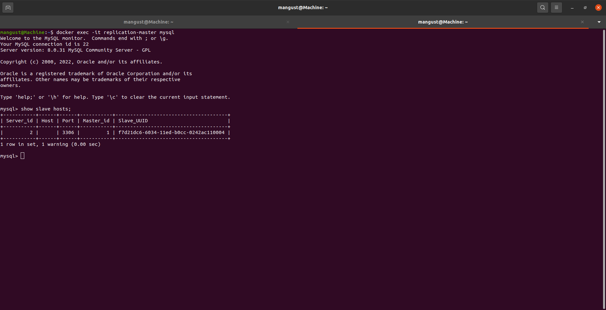
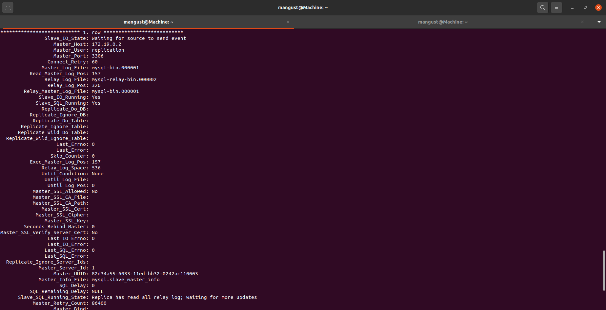
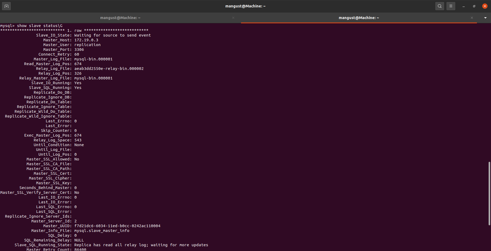
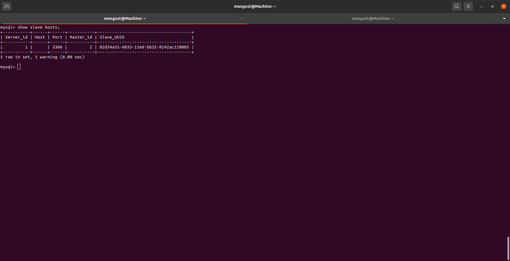
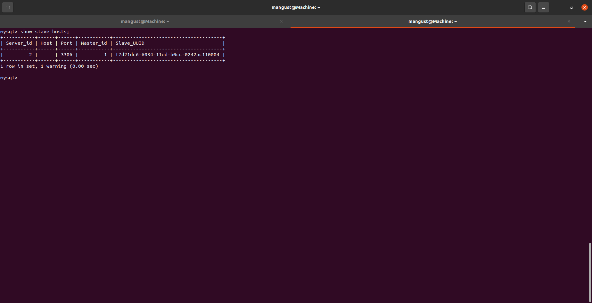

---

### Задание 1.

На лекции рассматривались режимы репликации master-slave, master-master, опишите их различия.

*Ответить в свободной форме.*

```
В режиме master - slave, данные с клиента пишутся на master и уже оттуда реплицируются на slave. При этом клиент может считывать информацию с slave.
В режиме master - master, клиент может писать и считывать данные с обоих нод. 
```
---

### Задание 2.

Выполните конфигурацию Master-Slave репликации (примером можно пользоваться из лекции).

*Приложите скриншоты конфигурации, выполнения работы (состояния и режимы работы серверов).*

MASTER_NODE:

SLAVE_NODE:

---

## Дополнительные задания (со звездочкой*)

Эти задания дополнительные (не обязательные к выполнению) и никак не повлияют на получение вами зачета по этому домашнему заданию. Вы можете их выполнить, если хотите глубже и/или шире разобраться в материале.

---

### Задание 3*. 

Выполните конфигурацию Master-Master репликации. Произведите проверку.

MASTER_NODE1

MASTER_NODE1

MASTER_NODE2


*Приложите скриншоты конфигурации, выполнения работы (состояния и режимы работы серверов).*
