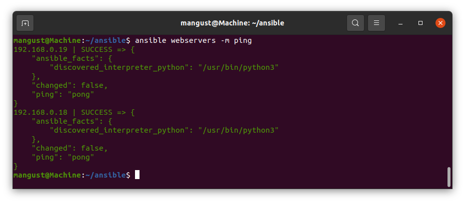
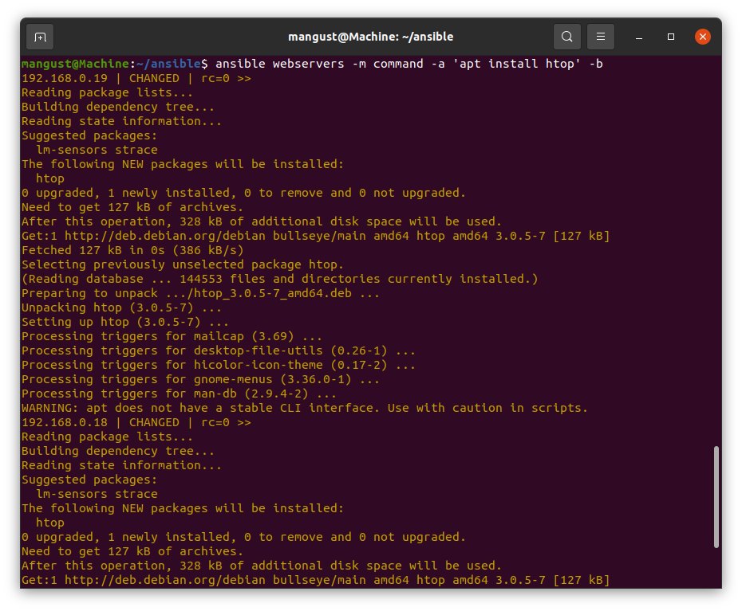
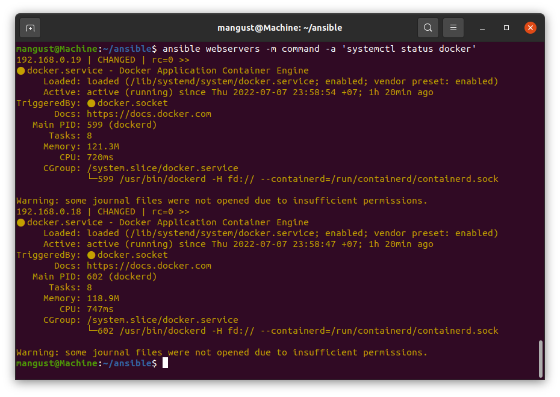
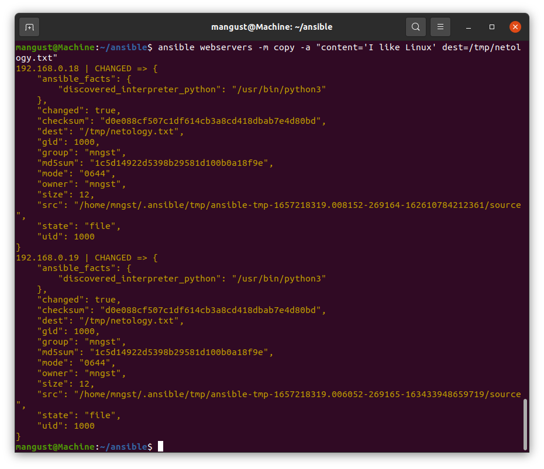

---

### Задание 1

Какие преимущества дает подход IAC?

*Приведите ответ в свободной форме.*

IaC уменьшает время разворачивания инфраструктуры, позволяет быстро восстановить сервисы после аварийных ситуаций. Упрощает управление, предоставляя возможность управлять множеством серверов/машин. 

---

### Задание 2 

1. Установите Ansible.
2. Настройте управляемые машины (виртуальные или физические, не менее двух).
3. Создайте файл инвентори. Предлагается использовать файл, размещенный в папке с проектом, а не файл инвентори по умолчанию.
4. Проверьте доступность хостов с помощью модуля ping.

*Приложите скриншоты действий.*

 
---

### Задание 3 

Какая разница между параметрами forks и serial? 

*Приведите ответ в свободной форме.*
Параметр forks указывает на каком количестве хостов может одновременно выполняться задача(task), при этом, если задач несколько, то выполняться они будут линейно
( сначала первая задача на всех хостах, потом вторая и т.д. ).
Параметр serial позволяет указать на каком количестве хостов нужно выполнить задачу, прежде чем перейти к следующей задаче.

---

### Задание 4 

В этом задании мы будем работать с Ad-hoc коммандами.

1. Установите на управляемых хостах пакет, которого нет(любой).
2. Проверьте статус любого присутствующего на управляемой машине сервиса. 
3. Создайте файл с содержимым "I like Linux" по пути /tmp/netology.txt

*Приложите скриншоты запуска команд.*

---
