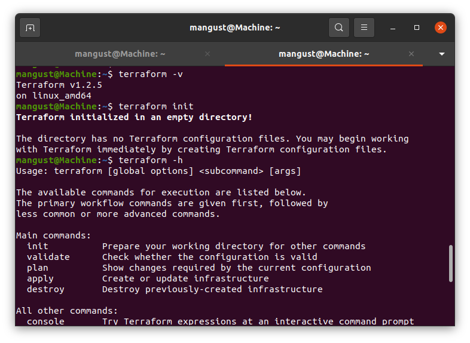

---

### Задание 1.

Опишите виды подхода IaC:
1. Функциональный
2. Процедурный 
3. Интеллектуальный

*Приведите ответ в свободной форме.*

```
Функциональный (декларативный) подход - подразумевает описание конечного состояния системы системы с указанием необходимых ресурсов, которую должен реализовать инструмент (Что?)
Процедурный (императивный) подход - описывает, какие изменения необходимо внести чтобы достичь желаемой конфигурации (Как?)
Интеллектуальный подход - описывает, почему инфраструктура инфраструктура должна быть так сконфигурирована (Почему?)
```
---

### Задание 2.

Как вы считаете, в чем преимущество применения terraform?

*Приведите ответ в свободной форме.*

```
Terraform как инструмент IaC включается в себя все плюсы данного подхода, такие как: скорость, простота управления
Если же говорить конкретно о Terraform, то можно выделить универсальность. Terraform позволяет работать с множеством различныx поставщиков облачных услуг.
```
---

### Задание 3.

Какие минусы можно выделить при использование IaC?

*Приведите ответ в свободной форме.*

```
Как правило в подходе IaC используется большое разнообразие технологий, где могут различаться требования и языки конфигурационных файлов, что ставит условие необходимости высокой квалификации персонала.
Чувствительность к ошибкам в коде. Всего одна ошибка может привести к проблемам.
Необходимость централизованного управления, чтобы не возникло ситуаций когда разные люди работают над одной и той же конфигурацией. 
```
---

### Задание 4.

Установите Terraform на компьютерную систему (виртуальную или хостовую) используя лекцию или https://learn.hashicorp.com/tutorials/terraform/install-cli

*Приложите скриншоты запуска команд.*

---

## Дополнительные задания (со звездочкой*)
Эти задания дополнительные (не обязательные к выполнению) и никак не повлияют на получение вами зачета по этому домашнему заданию. Вы можете их выполнить, если хотите глубже и/или шире разобраться в материале.

---

### Задание 5*.

Перечислите основные функции, которые могут использоваться в terraform.

*Приведите ответ в свободной форме.*
```
Числовые функции
Строковые функции
Функции для работы со списками
Функции кодирования
Функции для работы с файловой системой 
Функции даты и времени
Хэш и криптографические функции
Функции для работы с IP сетями
Функции преобразования типов
```
