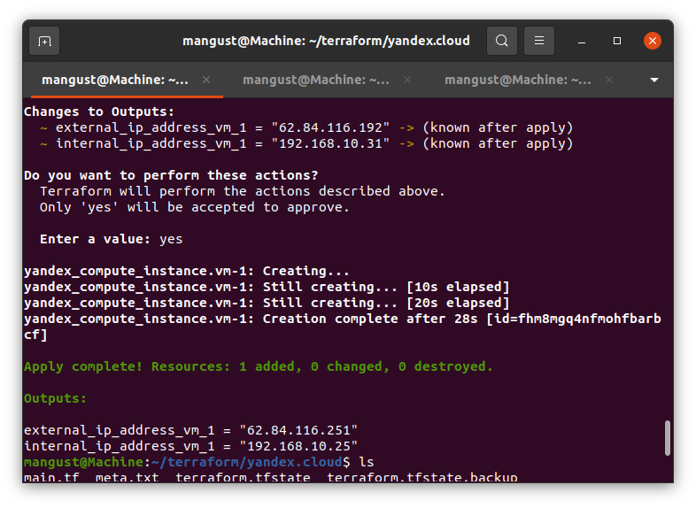
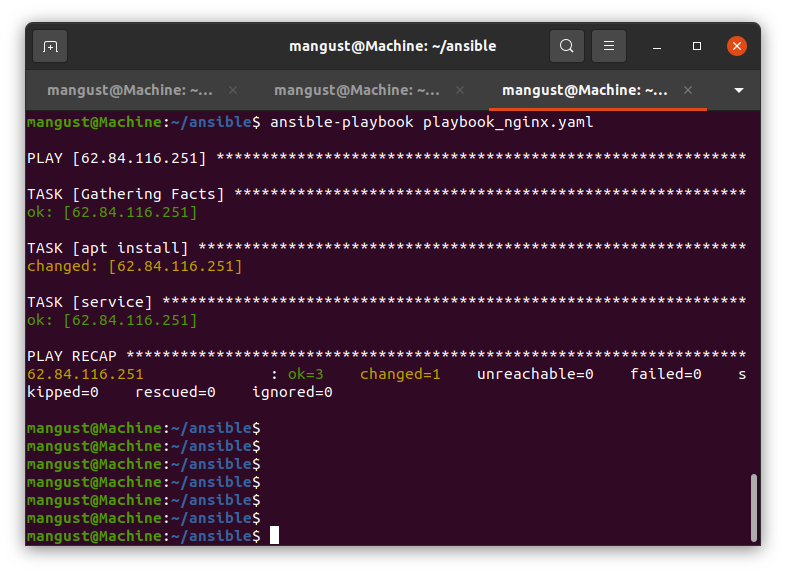
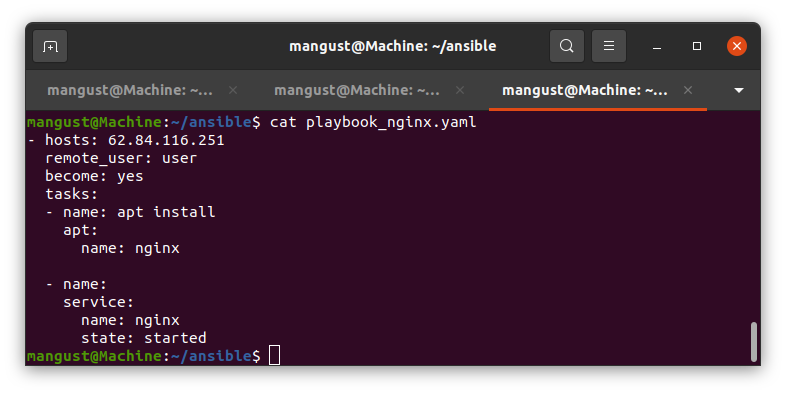

---

### Задание 1. 

От заказчика получено задание: при помощи Terraform и Ansible, собрать виртуальную инфраструктуру и развернуть на ней Web-ресурс. 

В инфраструктуре нужна одна машина с ПО ОС Linux, 2 ядрами и 2 Гигабайтами оперативной памяти. 

Требуется установить nginx, залить при помощи ansible конфигурационные файлы nginx и Web-ресурса. 

Для выполнения этого задания требуется сгенирировать ssh ключ командой ssh-kengen. Добавить в конфигурацию terraform ключ в поле:

 metadata = {
    user-data = "${file("./meta.txt")}"
  }
 
Провести тестирование. 

*Прислать скан скриптов, скан выполненного проекта.*

---

## Дополнительные задания (со звездочкой*)

Эти задания дополнительные (не обязательные к выполнению) и никак не повлияют на получение вами зачета по этому домашнему заданию. Вы можете их выполнить, если хотите глубже и/или шире разобраться в материале.
 
### Задание 2*.

1. Перестроить инфраструктуру и добавить в нее вторую виртуальную машину. 
2. Установить на вторую виртуальную машину базу данных. 
3. Выполнить проверку состояния запущенных служб через Ansible.

*Прислать скан скриптов, скан выполненного проекта.*

---
