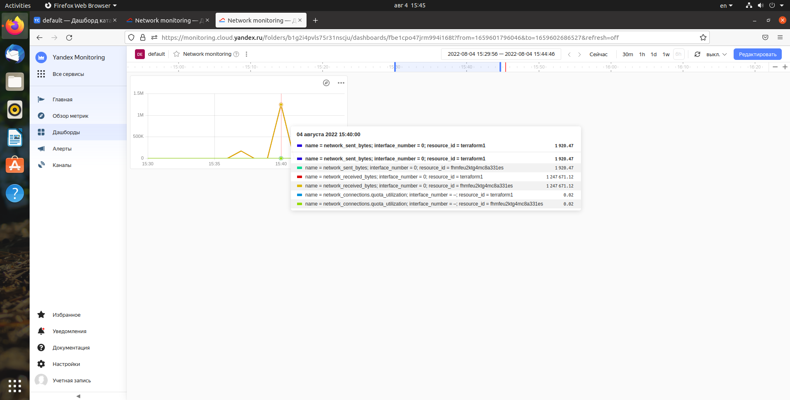

 ---
 
### Задание 1. 

Какие преимущества и недостатки реактивного и проактивного мониторинга?

*Приведите ответ в свободной форме.*

Реактивный мониторинг - простейший вид мониторинга, который собирает информацию о состоянии системы и позволяет обнаруживать сбои уже когда они произошли. 
Проактивный мониторинг позволяет не только собирать информацию но и прогнозировать критическое состояние и предовратить появление сбоя. 

---

### Задание 2.

Какие метрики необходимо мониторить у веб-страницы, чтобы знать о ее доступности и функциональности?

*Приведите ответ в свободной форме.*

Скорость загрузки страниц; Количество пользователей; Количество отказов ( количество пользователей, покинувших сайт, не совершив каких-либо действий);
Время на сайте; Глубина просмотра страниц.

---

### Задание 3.

С помощью Yandex Monitoring создайте дашборд, на котором видны основные метрики сетевого подключения вашей виртуальной машины.

*Приложите скриншоты.*

---

## Дополнительные задания (со звездочкой*)
Эти задания дополнительные (не обязательные к выполнению) и никак не повлияют на получение вами зачета по этому домашнему заданию. Вы можете их выполнить, если хотите глубже и/или шире разобраться в материале.

---

### Задание 4*.

С помощью Yandex Monitoring сделайте 2 алерта на загрузку процессора: WARN и ALARM. И создайте уведомление по e-mail.

*Приложите скриншот с уведомлением.*
