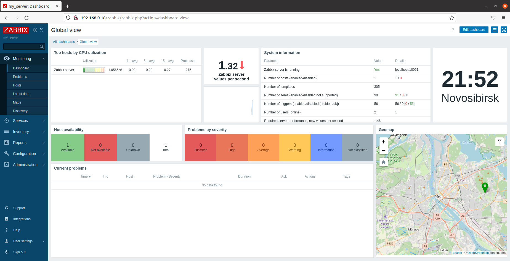
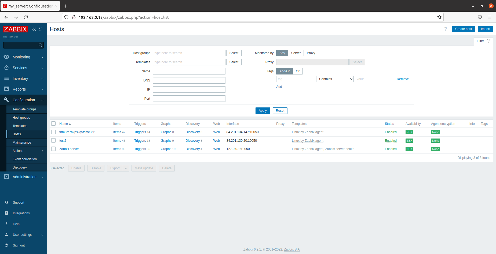
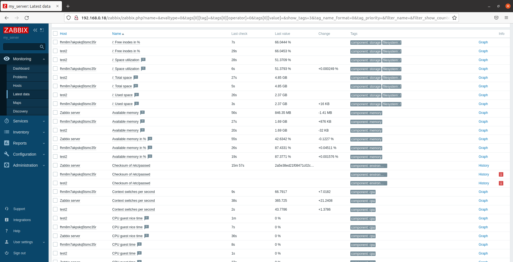
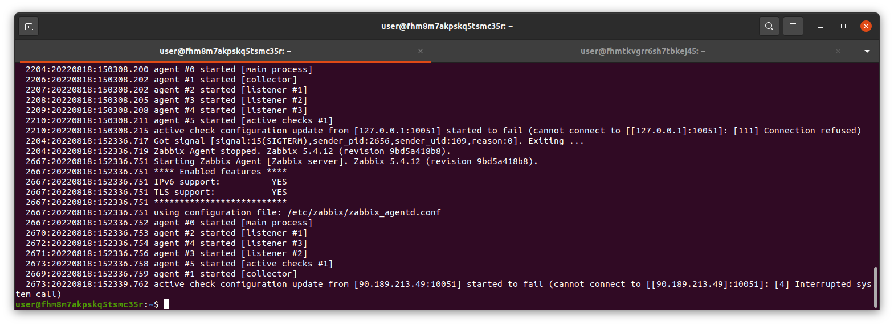
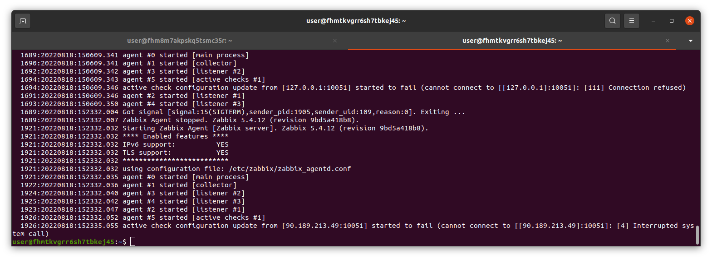

---

### Задание 1. 

Чем Zabbix может помочь в решении ваших задач?

*Приведите ответ в свободной форме.*

Zabbix позволит решить задачу мониторинга сетевой инфраструктуры.

---

### Задание 2. 

Установите Zabbix Server с веб-интерфейсом.

*Приложите скриншот авторизации в админке*

---

### Задание 3. 

Установите Zabbix Agent на два хоста.

*Приложите скриншот раздела Configuration > Hosts, где видно, что агенты подключены к серверу.*
*Приложите скриншот лога zabbix agent, где видно, что он работает с сервером.*
*Приложите скриншот раздела Monitoring > Latest data для обоих хостов, где видны поступающие от агентов данные.*

---
## Дополнительные задания (со звездочкой*)

Эти задания дополнительные (не обязательные к выполнению) и никак не повлияют на получение вами зачета по этому домашнему заданию. Вы можете их выполнить, если хотите глубже и/или шире разобраться в материале.

### Задание 4*. 

Установите Zabbix Agent на Windows компьютер и подключите его к серверу Zabbix.

*Приложите скриншот раздела Latest Data, где видно свободное место на диске C:*
